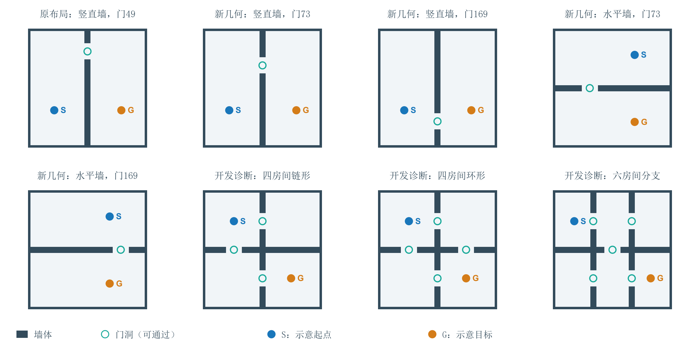

# LeWM × Navigation：测试环境、结果与不足

## 1. 测试环境是什么样的？

主要环境是2D平面、全局俯视图，可以理解成从上方看小球穿过房门。小球在平面上连续移动，墙体阻挡行动；若目标在墙另一侧，需要绕到门洞再通过。模型接收224×224的当前图像和目标位置图像，在最多150个环境步内进入目标范围即成功。

模型能从图像看到完整布局，但普通LeWM规划器没有直接拿到可搜索的房间连接图。真实坐标用于初始化和评估；只有特权路点诊断额外利用真实图与位置产生中间目标。“未知地图”是训练未见、测试仍能看到全图的新布局，不是边走边探索建图。

平面图依据实验配置与环境代码绘制，展示墙体和门洞关系；S/G为示意起终点，不对应某个测试病例，也不是模型输出轨迹。上方不是第一人称视角；颜色和标记用于解释，不代表模型实际输入的渲染样式。

布局来源：final_geometry_v1/catalog.json、maps/catalog.json、topology_env.py。前五图为两房间原布局与最终新几何，后三图为自建多房间开发诊断，评估协议不同。

| 测试组 | 环境有什么不同 | 评估范围 | 回答的问题 |
| --- | --- | --- | --- |
| 原布局，新起终点 | 房子和门不变，换出发点与目的地。 | 最终300个预留回合，3个独立训练种子。 | 能否在熟悉布局中完成没用来开发方法的任务。 |
| 两房间，新几何 | 门换到坐标73或169；隔墙分别为竖直、水平。 | 4张最终新图，每图100例，3个训练种子。 | 能否把能力迁移到新的门位置和墙方向。 |
| 自建多房间 | 四房间链形、四房间环形、六房间分支。 | 开发压力测试；关键单/多布局与路点比较为匹配种子4001。 | 能否连续穿门、处理分岔；同时受新模拟器、尺度与外观影响。 |

严格模型按完整回合/重复轨迹组隔离：8000训练、1000验证、1000测试，归一化只用训练集。三个种子均训练10轮、51920次更新。开发病例用于选方法；最终另用300个预留回合与4张新几何地图。最终238批共11900次环境评估共享病例，不能当作11900个独立场景。

## 2. 五种方法有什么不同？

| 方法 | 通俗解释 | 与原始方法的区别 |
| --- | --- | --- |
| 原始LeWM | 使用原来的特征距离给动作评分。 | 是其他方法的基础对照；预测视野H5。 |
| H10暖启动 | 预测得更远，并接着利用上次还没执行的计划。 | 不训练新模型；H10指模型预测步，不等于150个环境步。 |
| 时间评价头 | 加一个小评分模块，学习训练轨迹中两个状态相隔多久。 | 世界模型冻结；额外训练评分头，不是原版自带能力。 |
| 仅检索 | 从训练轨迹找相似情况，借用已有动作。 | 使用LeWM图像表示，但不调用动作条件预测器。 |
| 检索＋动态排序 | 先找经验动作，再预测后果并重新排序。 | 用于检查“预测未来”是否比直接借用经验更有用。 |

公平性：原始、H10与时间头的候选模型步上限均为90000；检索排序9000，仅检索0。它们并非总算力相等，评分头训练、检索建库和实际提前停止也有不同成本。批处理耗时不是单机器人在线时延。

## 3. 最终性能如何？

成功率单位为%，数值是三个独立训练种子的均值 ± 样本标准差。

| 环境 | 原始LeWM | H10暖启动 | 时间评价头 | 仅检索 | 检索＋排序 |
| --- | --- | --- | --- | --- | --- |
| 原布局，新起终点 | 60.89 ± 2.04 | 50.44 ± 2.22 | 98.89 ± 1.07 | 97.33 ± 0.88 | 98.67 ± 0.00 |
| 竖直墙，门73 | 24.67 ± 2.08 | 27.67 ± 2.31 | 91.33 ± 2.52 | 80.67 ± 4.93 | 85.00 ± 2.65 |
| 竖直墙，门169 | 15.67 ± 1.53 | 21.00 ± 0.00 | 51.00 ± 1.00 | 47.67 ± 1.53 | 46.67 ± 0.58 |
| 水平墙，门73 | 9.00 ± 1.73 | 10.00 ± 3.61 | 10.67 ± 4.04 | 9.00 ± 2.00 | 13.33 ± 1.15 |
| 水平墙，门169 | 8.00 ± 2.00 | 11.00 ± 4.00 | 9.00 ± 3.61 | 8.00 ± 1.73 | 12.67 ± 2.52 |

原布局中，时间头与经验检索能把表现从约六成提高到接近全部成功；门换位置后有的地图仍有效，但墙方向改变后大多失败。特别是门169：时间头整体51%，实际是同侧约99%、跨墙约3%，并非已经解决一半绕障任务。

原布局目标来自轨迹，合成新图独立采样起终点，难度组成不同；不把分数差全部归因于地图变化。3个边界投影起点共同排除后的297例结果仍支持主要结论。标准差表示三个训练种子的波动，不是置信区间。

## 4. 各组诊断说明了什么？

下表中的开发诊断、多布局训练和多房间实验不是同一组最终测试，不能把数字直接横向排名。

| 对照组 | 结果 | 通俗结论 |
| --- | --- | --- |
| 同侧 vs. 跨墙 | 竖直墙、门169的时间头：同侧约98.67%，跨墙仅3.33%，合计51%。 | “成功一半”掩盖了需要穿门的任务几乎没有解决。 |
| 有效时间标签 vs. 打乱标签 | 开发验证三个种子：正常时间头97%/100%/100%，打乱标签6%/9%/4%。 | 提升依赖有意义的监督，不是随便加一个小网络就有效。 |
| 短视野 vs. 长视野 | 开发验证H10暖启动看起来有利；最终原布局由原始60.89%降到50.44%。 | 想得更远不一定走得更好；尚未单独确定下降原因。 |
| 直接检索 vs. 再用预测器排序 | 最终原布局97.33% vs. 98.67%；逐种子配对区间均跨零。门169跨墙排序后三种子均为0。 | 尚无稳定显著的大幅额外收益，排序还可能损害跨墙行动。 |
| 单布局 vs. 8布局训练 | 另做相同采集方式、总帧数和更新数的种子4001配对；原几何30%→9%，验证竖直门65为23%→6%。 | 增加地图种类没有自动奏效；每图数据减少，且只有一个种子对，不能据此说更多数据无用。 |
| 全局目标 vs. 特权路点 | 多布局模型同H5/R1：链形21%→38%，环形32%→64%，六房间10%→9%（16像素切换）。 | 正确中间目标能帮助部分多房间导航，但仍不能稳定执行整条路线。 |
| 8像素 vs. 16像素路点切换 | 多布局环形43%→64%，只改变路点切换容差。 | 高层目标要匹配低层能到达的精度；这是开发敏感性分析，不是独立最终测试。 |

早期探索另使用两个训练种子及公开权重，结果见 [探索报告](../../exploratory/reports/README.md)；其划分与上述严格最终协议不同，不作为额外独立种子混入主表。

## 5. 目前不足

### 会靠近目标，不代表会绕障

目标就在墙对面时，正确行动可能需要先远离目标、绕到门洞。原始特征距离没有直接表达实际通路；时间头能修复部分评分，却在新几何的跨墙任务中仍然失败。

### 熟悉房子里很强，换结构后仍弱

时间头在原布局约99%，墙改成水平后约9%—11%。它能看到全图仍然失败，说明不能首先归咎于看不见或缺少记忆；具体是表示、预测还是评分，尚未完全拆开。

### 世界模型预测的独立价值还不够清楚

仅检索已经很强，动态排序没有稳定的大增益。未来改进需要在相同候选上超过“经验动作直接执行”，而不只是超过原始LeWM。

### 远期计划与连续执行不可靠

延长预测范围没有保证更好；给正确路点也没有解决六房间任务。既要检查路线是否合理，也要检查每一小段能否真实完成、何时切换目标。

### 数据覆盖与评价范围仍有限

多布局训练只有一个匹配种子对，且自建环境同时改变模拟器、尺度和外观。第一人称、遮挡记忆、动态障碍、实机及全部大型论文基线没有测试，不能外推成真实导航能力结论。

优先研究的问题是：如何让模型判断“真正走得到”，而不只是“看起来离目标近”；其次检查未来预测能否可靠筛选动作，以及中间目标能否被低层控制实际完成。记忆和语言是后续扩展，不能替代当前全观测下的几何与执行问题。

## 6. 相关工作对照表

文献范围沿用2026年9月10日的22项工作及指定版本。表中效果为各论文报告，不是本项目复现值；任务、传感器、成功半径和预算不同，不能跨行排名。“不足”同时包含论文证据边界与迁移风险分析，不把风险当作已证实的失败。

术语：成功率是最终到达目标的比例；SPL同时考虑成功与绕路程度；轨迹误差衡量与参考轨迹的偏差。离线评估是在已有记录上检查，闭环评估则是真正执行动作、观察结果并继续走。

### 基础表示与世界模型

| 工作／版本 | 研究方向 | 主要改进：通俗解释 | 论文报告的效果 | 不足与适用边界 |
| --- | --- | --- | --- | --- |
| [LeWM](https://arxiv.org/html/2603.19312v3)；2026 预印本 | 轻量世界模型；本项目基础。 | 把画面压成简短特征，根据动作预测下一状态；用防退化约束避免把所有画面编码成一样的内容。规划时比较预测终点与目标的特征距离。 | 约1500万参数；论文报告单GPU数小时级训练，可用于导航和操作任务。 | 训练稳定、模型小，不代表懂得绕障。特征接近未必实际可达；TwoRoom俯视任务不能代表真实机器人导航。 |
| [PLDM](https://arxiv.org/html/2502.14819v4)；NeurIPS 2025 | 从没有奖励标签的轨迹中学习，再规划行动。 | 同时学习画面表示和多步动作后果；可用多个预测器的分歧惩罚不确定路线。任务变化时可调整评分。 | 论文TwoRoom高质量数据成功率97.8%；去掉穿门轨迹后降到34.4%。 | 关键通路的数据缺失会明显影响表现。多个模型也可能一起预测错；在线搜索仍有计算成本。 |
| [DINO-WM](https://proceedings.mlr.press/v267/zhou25t.html)；ICML 2025 | 让世界模型保留画面中的空间细节。 | 使用预训练DINOv2的分块特征，让模型不仅有整张图的摘要，还保留“东西在哪”；在这些特征中预测和规划。 | 论文Maze与Wall成功率98%和96%；同表DreamerV3这两项为100%。 | 依赖大型视觉预训练资源，规划计算更重。空间特征更丰富，也不自动等于知道绕墙路线。 |

### 可达性与候选评分

| 工作／版本 | 研究方向 | 主要改进：通俗解释 | 论文报告的效果 | 不足与适用边界 |
| --- | --- | --- | --- | --- |
| [TRM](https://arxiv.org/html/2605.22164v2)；2026 预印本 | 修正“看起来近”和“实际走得到”的错位。 | 冻结世界模型，利用轨迹中两个状态相隔的时间，训练一个小评分头；用它评价候选动作的终点。 | 论文高距离TwoRoom设置：原LeWM约7%，排除评估轨迹后的TRM约96.7%。 | 轨迹时间不等于最短路。新墙方向等变化仍有局限；同地图新轨迹成功，不等于未知地图通用规划。 |
| [RC-aux](https://arxiv.org/html/2605.07278v1)；2026 预印本 | 学习“剩下这些步数，够不够到目标”。 | 训练时既预测多步后果，又学习带步数限制的可达性；让表示、预测和规划评分更贴近到达任务。 | 论文TwoRoom续训对照88.8%→98.0%；Wall原LeWM50.4%→83.6%；PushT未提高。 | 多个训练项一起变化，需拆开验证贡献。负样本可能实际可达；论文误差条不是五个独立训练种子的波动。 |
| [MCR](https://arxiv.org/html/2608.09073v1)；2026 预印本 | 让模型把候选路线按好坏排对顺序。 | 给参考动作加入不同程度扰动，训练模型提高较差路线的目标代价，而不只要求预测准确。 | 同编码器下平均位移误差1.12→0.99米；实机为5/5成功，对照2/5。 | 偏离参考路线不一定更差，绕行也可能正确。实机仅5例，且使用独立低层避障，不能证明普遍可靠。 |

### 长程与分层规划

| 工作／版本 | 研究方向 | 主要改进：通俗解释 | 论文报告的效果 | 不足与适用边界 |
| --- | --- | --- | --- | --- |
| [HWM](https://arxiv.org/html/2604.03208v2)；2026 预印本 | 把远距离导航拆成多个容易完成的小段。 | 高层选择较远子目标与一段动作，低层负责走过去；两层按不同时间尺度规划，减少一口气搜索长动作序列的难度。 | 论文留出迷宫最难距离组：PLDM 44%→分层版本83%。 | 测试仍是全局俯视图，不是边走边探索。高层多了训练成本，提出的子目标未必能被低层实现。 |
| [Hi-LeWM](https://arxiv.org/html/2607.12547v2)；2026 预印本 | 研究给LeWM加高层规划何时有效、何时反而更差。 | 限制高层选择在经验支持的动作区域，并调整子目标执行时序，减少“想象很好、实际走不到”的计划。 | 论文PushT中、长距离分别提高11.3和14.7个百分点。 | 证据来自操作任务，不是未知地图导航。限制经验范围也可能挡住新路线；时序参数与高层模型的作用需分开。 |

### 动作候选与未来模拟

| 工作／版本 | 研究方向 | 主要改进：通俗解释 | 论文报告的效果 | 不足与适用边界 |
| --- | --- | --- | --- | --- |
| [NWM](https://arxiv.org/html/2412.03572)；CVPR 2025 | 先想象不同动作会看到什么，再选行动。 | 从第一人称视频学习动作条件扩散模型；既能独立搜索，也能为NoMaD提出的路线模拟未来并重新排序。 | RECON两秒轨迹位置误差：NoMaD 1.93米，NWM独立规划1.13米。 | 短轨迹误差不是未知建筑长程成功率。多候选、多步生成较慢；错误想象可能把好路线排到后面。 |
| [PiJEPA](https://openaccess.thecvf.com/content/CVPR2026W/WDFM-EAI/html/Chahe_Policy-Guided_World_Model_Planning_for_Language-Conditioned_Visual_Navigation_CVPRW_2026_paper.html)；CVPR 2026 Workshop | 让搜索从合理动作开始，而不是盲目试。 | 先由语言条件策略提出动作，再由JEPA世界模型优化这些候选；策略负责提供经验，模型负责比较后果。 | CAST离线位置误差：Octo 1.98米→PiJEPA 1.78米；并非每项指标都最好。 | 收益可能主要来自预训练策略。若策略没提出必要绕行动作，后续搜索仍会失败；不是长程闭环成功率证据。 |
| [NavWAM](https://arxiv.org/html/2606.13494v1)；2026 预印本 | 把预测未来与直接生成动作放进同一模型。 | 联合学习动作块、未来观察和目标进展，默认直接输出动作，减少反复搜索和评分。 | 论文实机24回合成功19次（79.2%），95%区间约59.5%—90.8%。 | 使用约20亿参数视频模型及额外适配数据。样本少、区间宽；不能把全部增益归功于未来预测。 |

### 空间表示与计算效率

| 工作／版本 | 研究方向 | 主要改进：通俗解释 | 论文报告的效果 | 不足与适用边界 |
| --- | --- | --- | --- | --- |
| [RAE-NWM](https://arxiv.org/html/2603.09241v2)；2026 预印本v2 | 让预测更多保留空间结构，而非只还原像素。 | 在DINOv2稠密视觉特征中预测未来，用运动和时间条件控制变化，再用目标特征距离规划。 | 论文Habitat图像目标导航成功率78.95%，成功与路径效率综合指标63.58%。 | 同表另一方法到达率较低却路径效率更高。表示、架构和容量同时变化；使用1米成功阈值，不能跨论文直接排名。 |
| [ReL-NWM](https://arxiv.org/html/2511.11011v2)；预印本；固定v2 | 减少导航规划中反复生成图像的开销。 | 用DINOv3特征和动作调制直接预测、评分，不必每次解码完整画面；实机作为高层路点规划器。 | 论文Gibson成功率60%，对照55%；每步规划1.49秒，对照5.21秒。 | 使用2米成功阈值。实机平滑运动与避障依赖独立低层系统；不能把其安全能力全部算给世界模型。 |
| [CompACT](https://arxiv.org/html/2603.05438)；CVPR 2026 | 用很少的特征单元降低规划计算量。 | 把稠密画面特征压缩成8或16个离散单元，世界模型在这些小表示上工作。 | 同硬件轨迹优化178.78秒→8单元4.83秒；位置误差1.262→1.373米，略变差。 | 是速度与精度的取舍，不是无损压缩。小门洞等细节可能丢失；针对大模型的加速倍数不能直接套到LeWM。 |

### 历史记忆与反馈

| 工作／版本 | 研究方向 | 主要改进：通俗解释 | 论文报告的效果 | 不足与适用边界 |
| --- | --- | --- | --- | --- |
| [NavMorph](https://arxiv.org/html/2506.23468)；ICCV 2025 | 让语言导航结合走过的路与下一步预测。 | 用递归状态整合历史，预测后续视觉特征，再用持续更新的上下文记忆辅助动作选择。 | 单目R2R-CE未见验证环境：成功率43.8%→47.9%，路径效率也提高。 | 仍有大量失败。完整系统同时用语言、历史等信息，不能把提升全算作预测更准；无关记忆可能干扰。 |
| [SC²-WM](https://arxiv.org/html/2608.07548)；ICML 2026 | 减少错误预测把导航决策带偏的风险。 | 先提出临时动作，再利用预测未来修正决策；在特定置信条件下进行测试时适配。 | 单目R2R-CE未见验证环境：NavMorph 47.9%→50.9%；路径效率33.2%→37.2%。 | 内部预测可以自洽但仍然错误。测试时更新可能放大噪声或遗忘；必须说明每回合是否重置记忆和参数。 |
| [UniWM](https://arxiv.org/html/2510.08713v3)；2026 预印本v3 | 统一动作、未来画面与长程记忆。 | 交替生成动作和后续观察，并筛选、保留有用历史，让行动与预测共享上下文。 | 论文Go Stanford离线评估成功指标0.45→0.75。 | 这里的成功阈值和离线评估不同于交互式导航。持续相信自己生成的画面，可能越来越偏离真实环境。 |

### 语言与物体目标

| 工作／版本 | 研究方向 | 主要改进：通俗解释 | 论文报告的效果 | 不足与适用边界 |
| --- | --- | --- | --- | --- |
| [UNeMo](https://ojs.aaai.org/index.php/AAAI/article/view/38895)；AAAI 2026 | 让语言导航器先设想下一节点，再细化选择。 | 结合语言和邻近观察预测未来视觉特征，用这些信息修正初步导航决定。 | 相同语言模型规模下，R2R未见验证环境成功率70.0%→72.1%。 | 主要是离散节点导航，候选节点已提供可行行动结构；不能直接等同于连续控制和自主避障。 |
| [WMNav](https://arxiv.org/html/2503.02247)；IROS 2025 | 寻找未知位置的物体，同时避免重复探索。 | 让视觉语言模型判断哪里更可能有目标，结合深度与位置维护探索价值地图，再选择探索方向。 | 论文物体目标导航：HM3D成功率58.1%，MP3D为45.4%。 | 语义常识可能与实际摆放不符，且依赖深度、位姿等信息。其核心是语义探索记忆，不是LeWM式逐动作动力学。 |

### 空间监督与统一生成

| 工作／版本 | 研究方向 | 主要改进：通俗解释 | 论文报告的效果 | 不足与适用边界 |
| --- | --- | --- | --- | --- |
| [NavWM](https://arxiv.org/html/2606.24101v1)；2026 预印本 | 把空间理解、动作选择与未来预测共同学习。 | 统一动作和未来视觉生成，结合空间监督、序列建模及轨迹候选信息。 | 论文四个离线数据集平均位置误差0.207，对照UniWM为0.302。 | 这是离线误差，不是闭环到达率。空间教师、候选先验等同时变化，收益来源需要单独验证。 |
| [SWAM](https://arxiv.org/html/2606.29908v1)；2026 预印本 | 让动作生成与空间几何更一致。 | 联合处理图像、深度和动作，利用深度教师与空间一致性训练未来世界和行动。 | 论文RECON位置误差0.93，对照NWM+NoMaD为1.53；生成约16.91秒/样本。 | 轨迹误差降低不代表能实时闭环控制。依赖额外空间监督；迁移时需考虑生成耗时和传感器条件。 |
| [GeniNav](https://openaccess.thecvf.com/content/CVPR2026/papers/Chen_GeniNav_Generative_Model_Driven_Image-Goal_Navigation_via_Imagination-Guided_Consistency_Flow_CVPR_2026_paper.pdf)；CVPR 2026 | 把语义子目标与几何可行路线结合。 | 用视觉语言模型设想中间目标，再生成一致的动作段，同时按语义与几何评价；提供闭环导航基准。 | 留出Gibson成功率68.7%，对照54.5%；迁移MP3D为55.2%。 | 仍存在碰撞；实机另有真实数据微调。完整系统不等于LeWM同类动力学，基线改造和额外资源需计入。 |

## 7. 结果文件

- [最终冻结结果](../../../experiments/strict_navigation/final_confirmation_v1/results.json)与[协议](../../../experiments/strict_navigation/final_confirmation_v1/protocol.json)。
- [汇总数据](../../final_summary.csv)与[逐例记录](../../final_cases.json)。
- [分层、预算及边界敏感性](final_supplementary_analysis.md)。
- [三种子规划对照](three_seed_planning_controls.md)、[迁移对照](three_seed_transfer_results.md)、[多布局配对](geometry_control_pair4001.md)与[路点容差](oracle_waypoint_t16_results.md)。
